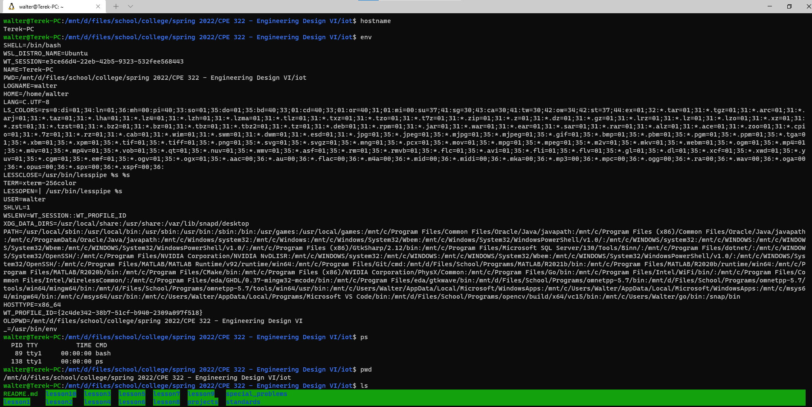
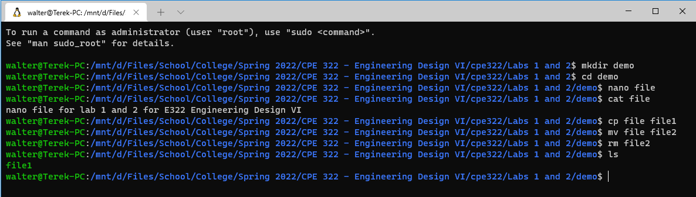
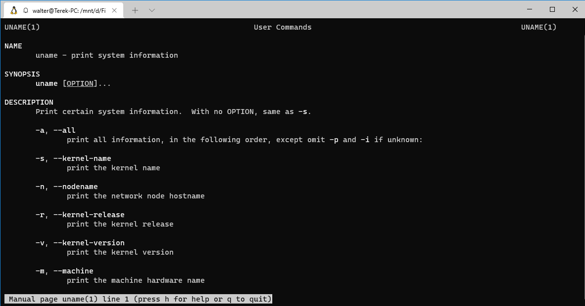
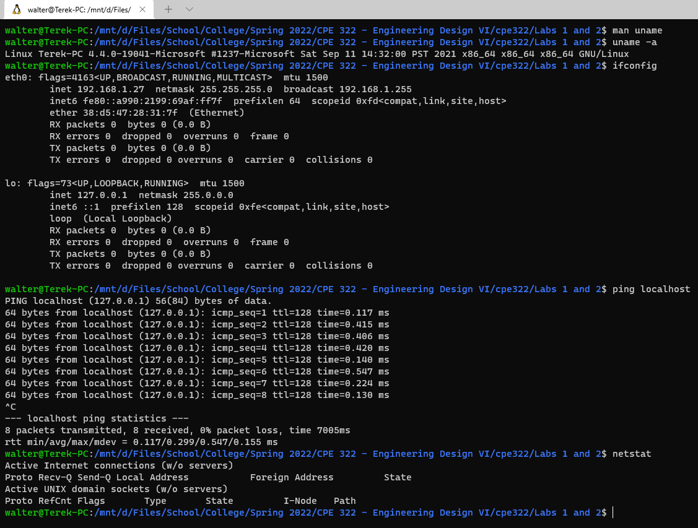

# Labs 1 and 2 - Command Line

Used WSL Ubuntu to execute the terminal commands in the lab. I had already cloned the iot git files, so I did not repeat the git clone command. I also did not cd into the iot directory since I was already there.

