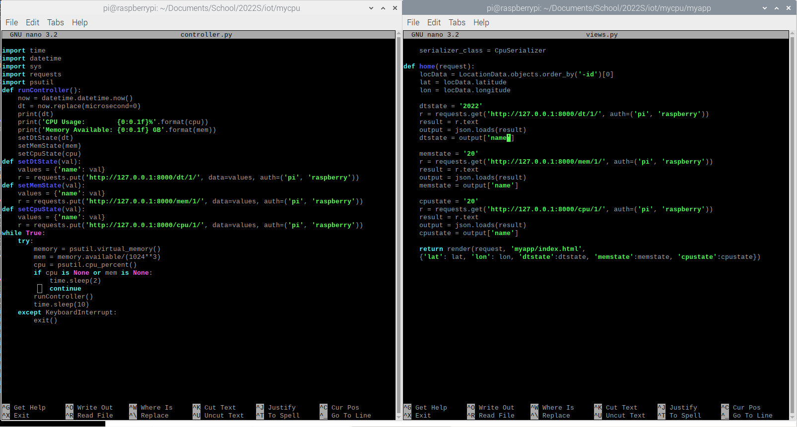
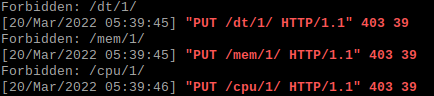
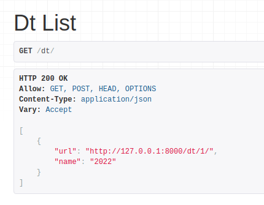
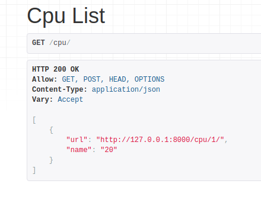
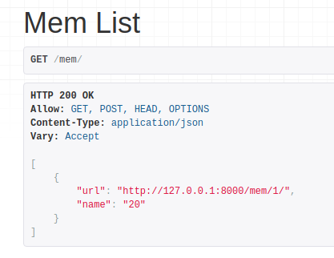

# Lab 4

I came across some errors regarding the mycpu server. I followed all steps, and spent about 2 hours trying to fix the issue. According to the /home directory of the server, sending the data has an invalid login, yet both username and password are the same for views.py and controller.py.

Just in case it has something to do with  dt, cpu, and mem, here are images of post HTML Post 2022, 20, and 20 respectively.

