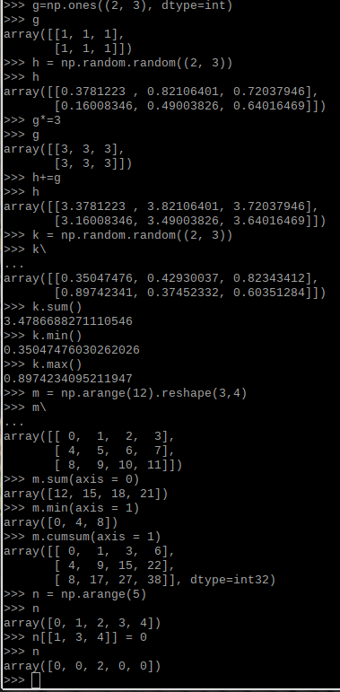
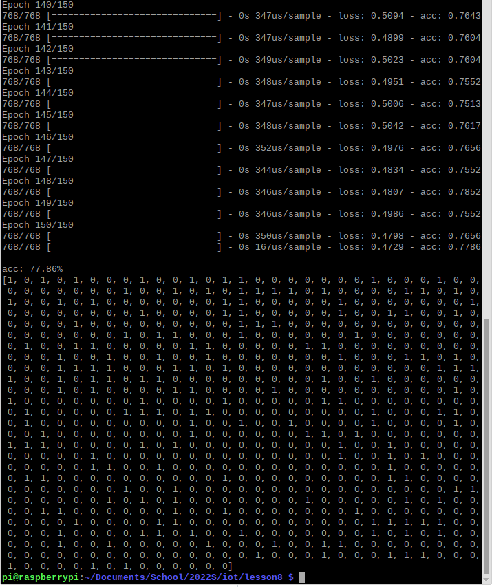
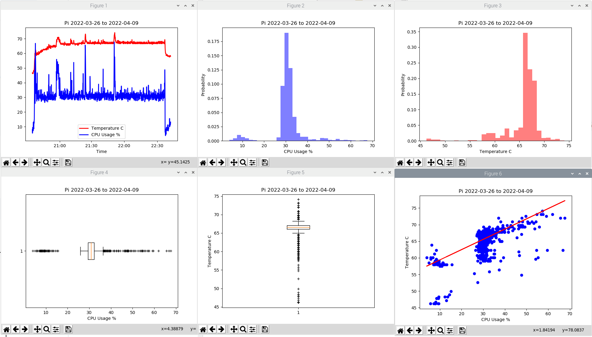
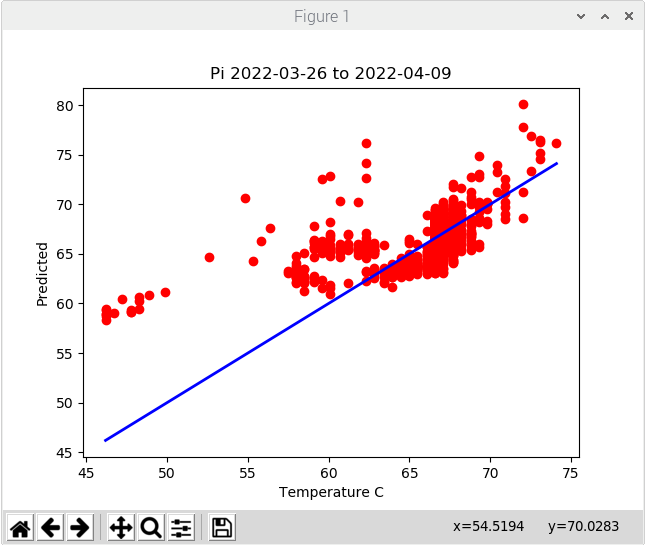

# Lab 8

### Numpy Array

Ran the following commands in a python3 terminal.

------------------------------------------------

### Review and Run Python Code

pyplot_simple.py

simple\_plot.py

pyplot\_formatstr.py

ticklabels\_demo\_rotation.py

pyplot\_three.py

pyplot\_two\_subplots.py

pyplot\_scales.py

pyplot\_annotate.py

major\_minor\_demo1.py

legend\_demo.py

------------------------------------------------------------

###Histograms, Box Plots, Regression, Interpolation

scatter\_demo.py

histogram\_demo\_features.py

pyplot\_text.py

histogram\_demo\_extended.py

boxplot\_demo.py

linreg.py

interpolation.py

------------------------------------------------------------------

### Classification, Cross-Validation (CV), Support-Vector Machine (SVM)

plot\_lda.py

plot\_lda\_qda.py

plot\_cv\_predict.py

plot\_cv\_diabetes.py

traffic.py

-----------------------------------------------------------

### Keras and Tensorflow

keras\_diabetes.py

keras\_first\_network.py

------------------------------------------------------------

### Titanic Example

titanic\_1.py

titanic\_2.py

------------------------------------------------------------

## Lab 8B: Data Analysis

plt_final.py

plt_cv2.py

